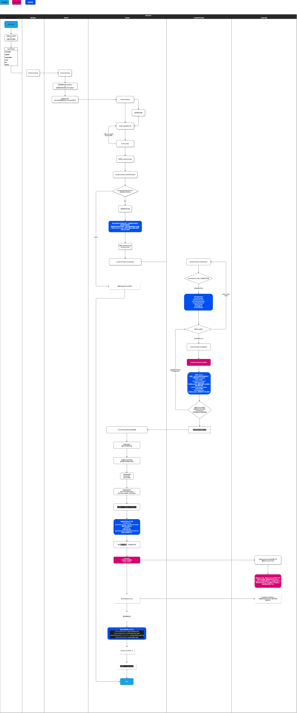

# Contribution Guide

项目为基于 [Lerna] + [Yarn Workspace] 的 Monorepo.

更多文档请查看 《[EasyOps 开发者中心](http://docs.developers.easyops.cn/)》

next-core 代码执行流程图 

## 安装依赖

`yarn`

## 开发

`yarn start`

> `yarn start` 等同于 `lerna run start --scope=@next-core/brick-container`。

开发服务默认会使用本仓库所在目录的兄弟目录中的 `next-basics` 目录作为构件仓库。也就是默认工作在类似：

```
/Users/one/easyops/next-core
/Users/one/easyops/next-basics
```

如果你希望调试其它地方的构件仓库，你可以在本项目的根目录中添加一个 `dev.config.js` 来配置构件仓库的位置，例如：

```js
const path = require("path");
exports.nextRepoDir = path.join(__dirname, "../next-basics");
```

## 构建

`yarn build`

## 测试

`yarn test`

测试单个文件使用 `yarn test` 加上文件路径即可，例如 `yarn test ./path/to/your.spec.ts`。

## 文件结构

项目包含两个多包工作区：

```bash
.
├── dll/*                 # <DLL> Scope: `@next-dll/*`
├── packages              # <平台库> Scope: `@next-core/*`
    ├── brick-container   # 新 Console
    ├── brick-dll         # Vendors dll
    ├── brick-http        # Http 基础库
    ├── brick-kit         # 插件运行时
    ├── brick-scripts     # 用于构件开发的脚本工具
    └── sdk-scripts       # 用于 SDK 的脚本工具
```

## 开发调试

如果你希望调试本地版本的、属于 `@next-core/brick-dll` 的包，例如 `@next-core/brick-kit`，那么你需要依次打开三个终端，并分别运行：

1. `lerna run start --scope @next-core/brick-kit`；
2. `lerna run start --scope @next-core/brick-dll`；
3. `yarn start`。

这是由依赖关系决定的 `@next-core/brick-container` ==> `@next-core/brick-dll` ==> `@next-core/brick-kit`。开发其它包如 `@next-core/brick-utils` 同理。

由于目前不支持为 `yarn start` 传递类似 `yarn serve` 传递的 `--subdir` 等参数，需要使用对应的环境变量来设置相关参数。

- `SUBDIR=true` 等于 `--subdir`；
- `LOCAL_BRICKS=abc,xyz` 等于 `--local-bricks=abc,xyz`；
- `LOCAL_APPS=abc,xyz` 等于 `--local-apps=abc,xyz`；
- `NO_MERGE_SETTINGS=true` 等于 `--no-merge-settings`；
- 以此类推（将 `yarn serve` 支持的参数改为 `大写_常量` 格式作为名称）。

例如：

```shell
LOCAL_BRICKS=abc yarn start
# is similar to
yarn serve --local-bricks=abc
```

### 独立打包调试

使用本地框架调试远端的独立打包：

在本项目根目录创建一个文件 `dev.config.js`：

```js
exports.standaloneAppsConfig = [
  {
    // 将相关参数替换成调试目标上对应的数据。
    appDir: "agile-task/",
    appRoot: "/sa-static/agile-task/versions/1.0.6/webroot/",
    bootstrapHash: "8d14a6be80273699",
  },
  // 可以列出多个应用目录。
  // 没有出现在该配置列表中的应用将自动使用非独立模式。
];
```

然后运行：

```shell
yarn serve --subdir --server=https://admin.easyops.local
```

## 常见问题 FAQ

- CI 错误：
  - `Warning: You have changed the public API signature for this project`:
    - 可以为你的 PR 添加一个标签 `eve: update docs etc`，它会告诉我们的机器人 _Eve_ 来更新 docs etc。
    - 注意：这个错误用于发现提交的代码意外更新了公共 API 的情况，PR 作者及审查者需要关注这些变更是否是预期的。
  - `Manifest snapshot not match`:
    - 可以为你的 PR 添加一个标签 `eve: update dll manifest`，它会告诉我们的机器人 _Eve_ 来更新 DLL manifest。
    - 注意：这个错误用于发现提交的代码意外更新了 DLL exports 的情况，PR 作者及审查者需要关注这些变更是否是预期的。

[lerna]: https://github.com/lerna/lerna
[yarn workspace]: https://yarnpkg.com/lang/en/docs/workspaces/
